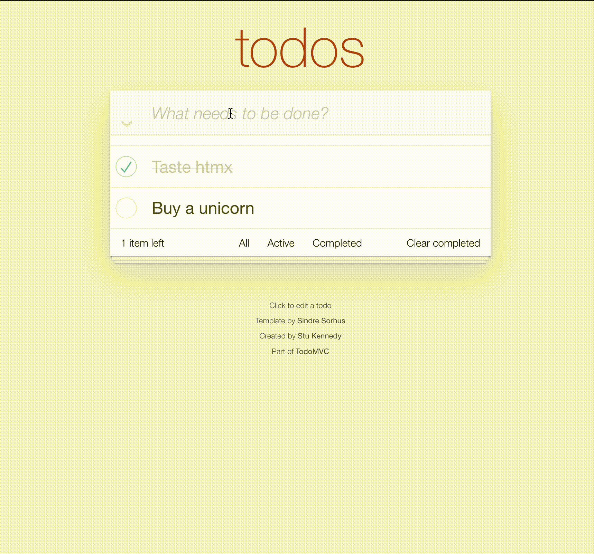

# HTMXX

## Back to the future of web development

A zero config full-stack web framework using [HTMX](https://htmx.org), [Mustache](https://github.com/janl/mustache.js) and a routing structure.
Reactive and responsive web development with proper [REST](https://htmx.org/essays/rest-explained/) endpoints (i.e. returning HTML not JSON)
And no need for any client-side Javascript. Use [Hyperscript](https://hyperscript.org/) for reactivity.



## How to install

```
npm i htmxx
```

Then just point it at a `routes` folder which contains your web-app to generate a resource of all the endpoints.
This resource can then be used by your server (e.g. Lambda function or ExpressJS) to render the endpoint.

```js
// src/index.js
const Htmxx = require('htmxx');

// synchronously generate the list of all endpoints
const htmxx = new Htmxx('/src/routes');
/* the full list of HtmxxFiles is now in htmxx.files */

// when a route is called with a specific method
const req = { body, params, query };
const { ws, markup, redirect } = await htmxx.processRoute(route, method, req);
```

`ws` is an optional boolean to identify whether the response should be sent to a websocket or not.
`markup` is optional HTML text returned and ready to serve to the client.
`redirect` is an optional Redirect object `{ status: string, location: string }` returned if the endpoint requests a redirect ready for you to redirect in your server.

# Routes folder

The web-app just consists of a routes folder containing the application routing structure as `html` files, that define the server endpoints.

e.g.

- `src/routes/index.html` defines a `GET` endpoint at `/`
- `src/routes/customers.post.html` defines a `POST` endpoint at `/customers`

## Special files

Any HTML files will be treated as an endpoint unless they begin with an underscore `_` (e.g. `_layout.html`). `*.html` is a `GET`, other methods (`POST`, `PUT`, `PATCH`, `DELETE`) are supported in by adding the lowercase prefix to the HTML extension e.g. `*.post.html` is a `POST`.
Special files `_layout.html` and `error.html` can be defined anywhere within our routes structure, these serve the following purposes:

### Layout files

These files allow nesting of content in your routes structure allowing layouts to be created at any level of the routing tree. They must contain a `<slot></slot>` tag to tell the framework where the content is to be rendered. We add the import for HTMX in the root `_layout.html` file.

e.g.

```html
<!DOCTYPE html>
<html lang="en">
  <head>
    <meta charset="UTF-8" />
    <meta http-equiv="X-UA-Compatible" content="IE=edge" />
    <meta name="viewport" content="width=device-width, initial-scale=1.0" />
    <script src="https://unpkg.com/htmx.org@1.8.0"></script>
    <title>HTMXX Demo</title>
  </head>
</head>
<body>
  <slot></slot>
</body>
</html>
```

If we navigate to `/`, the `index.html` will be rendered in the body.

### Error files

These files are displayed if an error occurs in the app.
An `_error.html` in the same directory as the error occured or in a directory above will be rendered in the case of an error.

### parameterised filenames

In many routing frameworks you have the ability to define variable path names e.g. `customers/:customerId` so that when a user navigates to `customers/56` the code can retrieve the `customerId` as 56 and load the correct data to display. This framework follows the same principle and it is defined by the folder and file structure.
If we create a folder structure `customers/[customerId]` we can place an `index.html` in the `customers` folder and another `index.html` in the `[customerId]` folder, or we could have a file called `[customerId].html` in the `customers` folder.
The `<script server>` block in `customers/[customerId].html` or `customers/[customerId]/index.html` would have access to the `params` variable which will contain `customerId` in this case. To handle a `POST` request for the specific customer you could use `customers/[customerId]/index.post.html` or `customers/[customerId].post.html`.

## Writing HTML endpoint files

The HTML file should be written in HTMX and with Mustache templating to format the markup.
Data is processed in a `<script server> </script>` block which should return data to the template.
This script is `async` so you can `await` any responses you want in here before rendering.

e.g.

```html
// src/routes/index.html

<script server>
  const cust = require('./customers'); // some model data
  const customers = await cust.getCustomers();

  return {
    customers,
  };
</script>

<ul id="list">
  {{#customers}}
  <li>{{name}}</li>
  {{/customers}}
</ul>
<div>
  <input type="text" name="customerName" />
</div>
<button hx-post="/customer" hx-swap="innerHtml" hx-target="#list">
  Add Name
</button>
```

## Redirecting from an endpoint

In some cases in your server-side code you may decide you need to redirect to a different route.
to do this, simply call `redirect(statusCode, location)` in your script
e.g.

```html
<script server>
  redirect(303, '/');
</script>
```

this will return `{ redirect: { status, location } }` from the `callEndpoint` method. You can use `status` and `location` to do the redirect in your server.

## Websockets

HTMX allows websocket support, so we have added it to our framework.
In your HTMX you can connect a form submission to a specific websocket endpoint like this

```html
<div hx-ws="connect:/tweet">
  <form hx-ws="send:submit">...</form>
</div>
```

To support this we provide an extra file type `*.ws.html`. In our example above we would define a websocket file like this:

```html
// src/routes/tweet.ws.html

<script server>
  const { message, username } = body;
  const tweets = require('~/model/tweets');

  const tweet = tweets.add(message, username);
  return tweet;
</script>

{{> post-frag}}
```

The body attribute contains the data sent by the form submission, so the code here is no different to writing a normal `POST`. The markup that is rendered is now broadcast on the channel instead of returned in an HTTP response, but the HTMX is handled the same way by the form.

Other endpoints can choose to also broadcast their markup response as well as respond with it by adding the `ws` attribute in the `script` tag.
The following `POST` endpoint generates a retweet fragment and broadcasts it to all clients.

```html
// src/routes/retweet/[id].post.html

<script server ws>
  const model = require('~/model/tweets');
  const { id } = params;
  return model.retweet(id);
</script>

{{> retweets-frag}}
```

See the `examples/twitterClone` folder for the full example.

## Aliased require paths

When requiring code in your server scripts you can either use relative paths, or the `~` operator will alias to the folder above your routes folder (e.g. your application root).
e.g.

```html
<script server>
  // src/routes/index.html
  // require file at src/models/customers.js
  const cust = require('~/models/customers');
</script>
```

## Using HTMX with endpoints

Each script module receives access to `params`, `query` and `body` variables which can be used to respond to the client requests. This next file will respond to the `POST` request sent from our `customers.html` above when the button is pressed.

```html
// src/routes/customer.post.html

<script server>
  const cust = require('./customers');
  // our model returns the updated list of customers after adding a new one
  const customers = cust.addCustomer({ name: body.customerName });
  return {
    customers,
  };
</script>

{{#customers}}
<li class="text-xl text-secondary m-4">{{name}}</li>
{{/customers}}
```

This `POST` response is loaded into the list element by the HTMX that called it.

## Writing HTML Partials

There is support for Mustache partials for re-use of code. This is especially handy as we are only returning HTML from our endpoints, which means we can be returning the same fragments of HTML from different endpoint methods.
In our customers example we might want to define the HTML for an `<li></li>`.
We can do this in a `_layout.html` file so that the fragment is available in all the child pages.

A fragment can be defined (preferably in a `_layout.html` like this:

```html
// src/routes/layout.html ...

<script type="text/html" id="my-fragment">
  <h3>My Fragment</h3>
</script>
```

And used like this

```html
// src/routes/layout.html ... {{> my-fragment}}
```

Any template variables will be rendered in their used context.

## TODO Example

See the `example` folder for a TodoMVC and Twitter Clone implementation in HTMXX running on ExpressJS.

## Resources

- [HTMX Website](https://htmx.org)
- [HTMX Documentation](https://htmx.org/docs)
- [HTMX Discord](https://htmx.org/discord)
- [Mustache Website](https://github.com/janl/mustache.js)
- [Hyperscript Website](https://hyperscript.org/)
